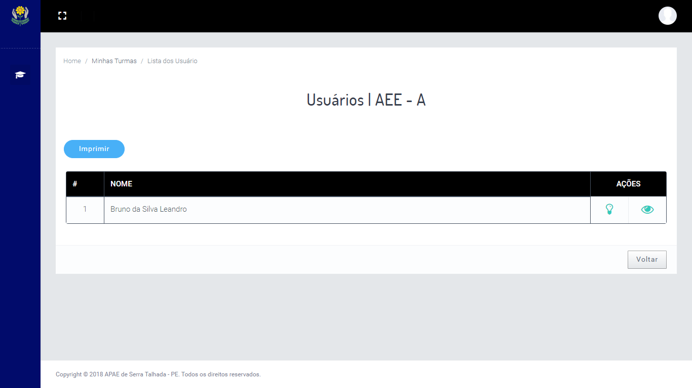

# SysAPAE is a project to control the Educational and Social Assistance areas of the APAE

## Introduction

The Association of Parents and Friends of the Exceptional (APAE) is a social organization, whose main aim is to promote integral care for people with intellectual disabilities, and multiple. 
The system aims to manage and automate the coordination processes, managing the flow of information pertinent to an APAE user.

## Requirements

This project needs the Python version 3.7.*, Django version 2.1, Pillow version 5.2.0 and pytz version 2018.5.

## Setup

Install Python 3.7.* from:

> "https://www.python.org/downloads/".

Upadate the pip by:

> pip install --upgrade pip

Install the libraries that are listed in the "requirements.txt" by:

> pip install -r requirements.txt

 
## SysAPAE

The system is divided into two modules, so that each person responsible for his area can control the relevant user information.

### Pedagogical

The pedagogical module is responsible for managing the information of the period in which the user uses APAE's pedagogical services.

#### Goal

This module manages and automates the information generated by the pedagogical coordinator and educators while the user with disabilities is using the pedagogical service.

#### Functionalities

* Class Control:

The pedagogical coordination can register a class by associating an educator, edit it by changing its name or the professional. It is also allowed to observe the class and view the history of classes and the frequency of students.

The educator can register, view, print, attend, complete class, and define user performance in that specific class. Based on these data, the educator can see how much that particular user has progressed from one class to another and can look for ways to exercise that activity more intensely.

* Educator Control: 

Pedagogical coordination can register educators in the system and define their position as educator, view their access to the system and their changes.

* Pedagogical Screening Control: 

The coordination can manage all users' logical screening, performing registration, research, editing and printing of the screening, navigating between two tabs that are: unrealized screening and performed screening, after the social screening performed, because, only then will it be available to the pedagogical.

* IEP Control: 

Every user who has a pedagogical screening will have a PEI - Individualized Educational Planning attached to it. With this, the educator can edit, view and print this data at any time he / she notes a development in the attributes mentioned.

* IEP Details: 

The IEP details are also displayed. Showing in addition to the user name and age, the data of the characteristics worked on it, as well as oral communication, reading and writing, logical-mathematical reasoning and computer science at school.

### Social Assistance

The social assistance module developed in this paper is responsible for APAE user follow-up data after the user joins the association.

#### Goal

This module will manage the socio-demographic form, the visits made to the resident user by the social assistance team and the referrals of any service provided by the association.

#### Functionalities

* Employee registration: 

The health and social assistance coordinators can register social workers and collaborators in the collaborator registration area. Social workers can also update user data, but employees can only view user data.
 
 
 
 * Access Record: 
 
 Coordinators can view the access records of social workers and employees, this record is formed by the date of access to the system and the user of the system that performed it.
 
 
 
 * Action Record: 
 
 Coordinators can also view the action records of social workers and coordinators, made for pertinent user data. This record is formed by the date of the action, the user of the system that performed the action, the type of action, whether it is editing or registration of any given data, what type of data was changed and the identification of the object that had its data changed.
 
 
 
 * User Control: 
 
 The system provides a control of users active in the organization, allowing you to register an APAE user, edit data, search, inactivate and print a user report.
 
 
 
 * Screening Control: 
 
 The system provides a control of the initial screening of the user ticket to the organization, allowing registering, edit the data, search, activate and print a report of the users screenings. It also provides a control of users who have already participated in the organization and are no longer with the active link, remaining with their registered data.
 
 
 
 * Visit Control: 
 
 You can also manage social care visits at a user's home. In this area, you can schedule the visits and which professional will perform, in the same way, you can edit the place or the professional responsible for the visit. The search and impression of the visit list can be performed by the user data, the date of the visit or the responsible professional.
 
 
 
 * Event Control: 
 
 The event area is used to create lists of attendance to the services offered by the association itself, likewise, there are events outside the association, which will assist APAE users. It is possible to schedule the date and time of attendance of the event, in the same way that it is possible to change the user's position, as for others in the list. The system also allows, edit, search and print a list of events already performed.
 
 
 
##  More Information

* [Monography - Social Assistance] (https://drive.google.com/open?id=1IzvX90QdxdD1PRMzn8NXYc2bEYgoRrCD)
* [Monography - Educational] (https://drive.google.com/open?id=1-aS0M_SWpli5rgBUtISZ_Jmdou88Bn4j)